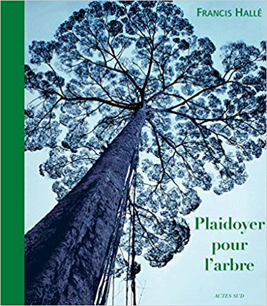
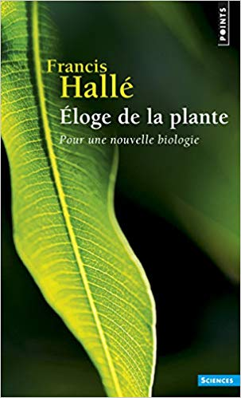
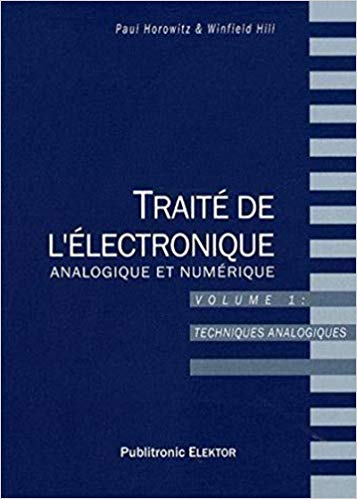
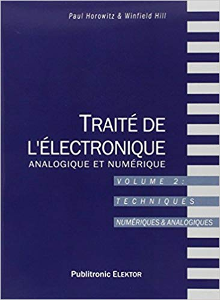
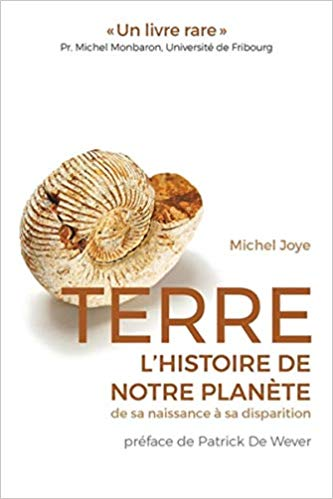
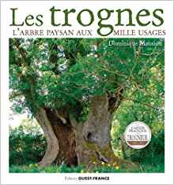
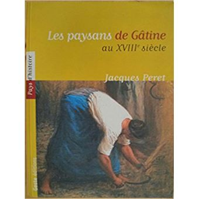
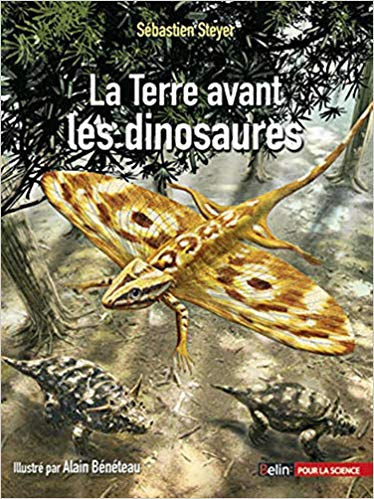
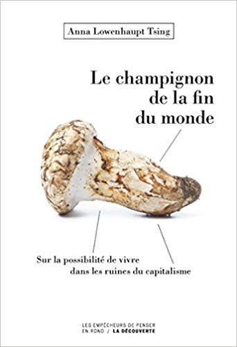
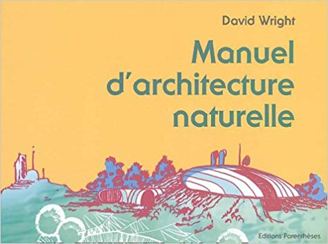

Livres utiles

Rien ne vaut l'expérience, mais l'expérience des autres vaut beaucoup. Les livres sont ainsi l'index de la vie. On n'apprend pas grand chose, ou si peu, en lisant l'index, mais on apprend bien plus vite le reste grâce à lui.

Voici une liste des livres qui nous sembles essentiels (imaginons par exemple en cas d'effondrement de la connaissance). Cette liste étant pour ainsi dire infinie, merci de croire que nous la construisons en toute humilité (de toute manière, travail en cours pour le démarrage).

Merci aussi de participer en proposant des ouvrages.

La liste est organisée par auteurs.

# H

**Plaidoyer pour l'arbre** de Francis Hallé - ISBN-13: 978-2742757121

**Éloge de la plante. Pour une nouvelle biologie** de Francis Hallé - ISBN-13: 978-2757842263

**Traité de l'électronique analogique et numérique. Tome 1, Techniques analogique**s de Paul Horowitz, Winfield Hill - ISBN-13:  978-2866611682

**Traité de l'électronique analogique et numérique. Tome 2, Techniques numériques et analogiques** de Paul Horowitz, Winfield Hill - ISBN-13:  978-2866610715

# J

**Terre, l'histoire de notre planète de sa naissance à sa disparition** de Michel Joye - ISBN-13: 978-2889152100

# K

Médecine traditionnelle chinoise - L'homme et ses symboles de Jean-Marc Kespi - ISBN-13 : 978-2501084789

# L

**L'Urine, de l'or liquide au jardin - Guide pratique pour produire ses fruits et légumes en utilisant les urines et composts locaux** de Renaud de Looze - ISBN-13 : 978-2359811001

# M

**Les trognes : L'arbre paysan aux mille usages** de Dominique Mansion - ISBN-13: 978-2737381393

# P

**Les paysans de Gâtine poitevine au XVIIIe siècle** de Jacques Péret - ISBN-13: 978-2910919757

# S

**The Year-Round Solar Greenhouse: How to Design and Build a Net-Zero Energy Greenhouse** de Lindsey Schiller et Marc Plinke - ISBN-13 : 978-0865718241

**L'entraide, l'autre loi de la jungle** de Pablo Servigne et Gauthier Chapelle - ISBN-13 : 979-1020904409

**La Terre avant les dinosaures** de Sébastien Steyer, Alain Bénéteau - ISBN-13: 978-2701142067

# T

**Le champignon de la fin du monde** de Anna Lowenhaupt Tsing - ISBN-13: 978-2359251364

# W

**Manuel d'architecture naturelle** de D. Wright - ISBN-13 : 978-2863641248